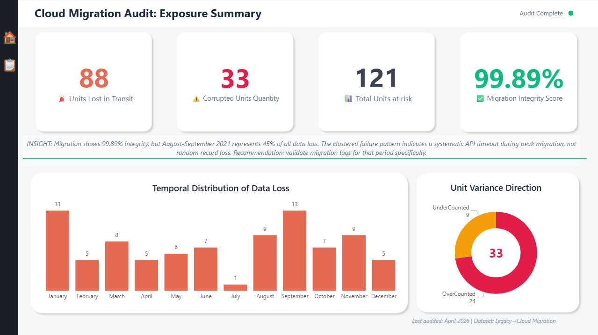
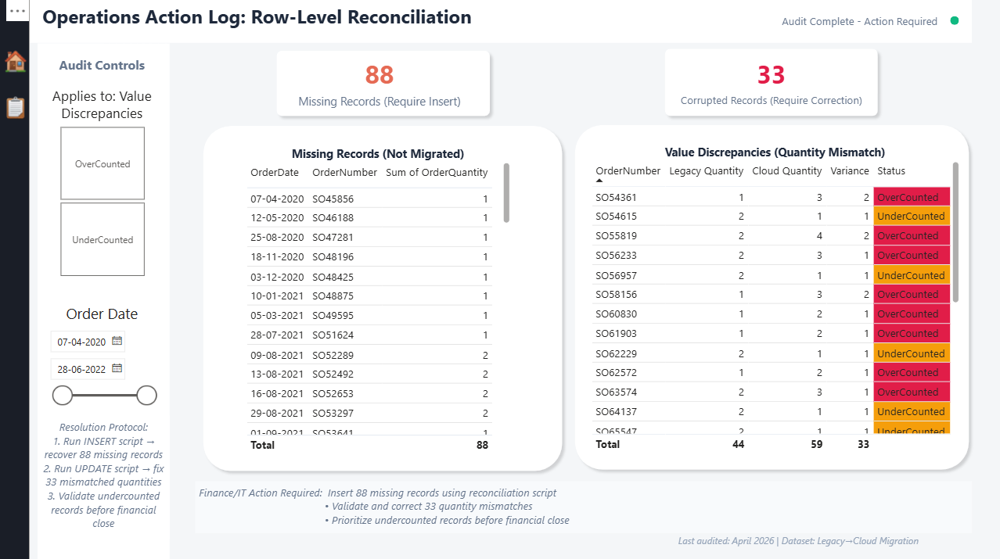

# Cloud Migration Data Reconciliation Audit

## Objective
Validate data integrity during a legacy CRM to cloud data warehouse migration by identifying completeness failures and value corruption using forensic SQL analysis.

## System Architecture & Audit Scope
* **Source System:** Legacy CRM (Source of Truth)
* **Target System:** Cloud Data Warehouse 
* **Migration Type:** Batch ETL 
* **Primary Key:** `(OrderNumber, OrderLineItem)`
* **Grain:** One row per order line item. 
* **Scope Definition:** This audit prioritizes Completeness (dropped records) and Value Integrity (mutated quantities). Duplicate validation and schema drift checks are recommended as secondary extensions.
* **Performance Note:** All forensic joins were executed on composite keys (`OrderNumber`, `OrderLineItem`) simulating indexed environments to ensure audit queries remain highly scalable for multi-million row datasets.

## Methodology

### Phase 1: Controlled Anomaly Injection (Python)
Created a ground truth dataset from 3 years of sales data (56,046 records) and simulated two real-world migration failures:
* **Completeness Error:** 60 records dropped.
* **Value Corruption:** 40 records with mutated quantities.


👉 | [View the Python Anomaly Injection Script](./python/migration_sabotage.py) |


### Phase 2: Forensic SQL Analysis (MySQL)

👉 | [View the Master Forensic SQL Script](./sql/reconciliation_audit.sql) |

**Test 1 — Completeness Check**
```sql
SELECT 
    l.OrderNumber, 
    l.OrderDate, 
    l.OrderQuantity,
    l.OrderLineItem,        
    'MISSING IN CLOUD' as error_type
FROM legacy_sales l
LEFT JOIN cloud_sales c
    ON c.OrderNumber = l.OrderNumber   
    AND c.OrderLineItem = l.OrderLineItem
WHERE c.OrderNumber IS NULL;
```
> **Result:** 60 orphan records identified (88 units completely lost).

**Test 2 — Value Integrity Check**
```sql
SELECT 
    l.OrderNumber,
    l.OrderQuantity as legacy_quantity,
    c.OrderQuantity as cloud_quantity,
    ABS(l.OrderQuantity - c.OrderQuantity) as quantity_variance,
    CASE 
        WHEN l.OrderQuantity > c.OrderQuantity THEN 'UnderCounted'
        WHEN l.OrderQuantity < c.OrderQuantity THEN 'OverCounted'
    END as Variance_direction
FROM legacy_sales l
JOIN cloud_sales c
    ON c.OrderNumber = l.OrderNumber 
    AND c.OrderLineItem = l.OrderLineItem
WHERE c.OrderQuantity != l.OrderQuantity;
```
> **Result:** 26 corrupted records identified (33 units variance).

**Test 3 — Business Impact (CTE)**
```sql
WITH Missing_Units AS (
    SELECT COALESCE(SUM(l.OrderQuantity), 0) as missing_quantity
    FROM legacy_sales l
    LEFT JOIN cloud_sales c 
        ON l.OrderNumber = c.OrderNumber 
        AND l.OrderLineItem = c.OrderLineItem
    WHERE c.OrderNumber IS NULL
),
Corrupted_Units AS (
    SELECT COALESCE(SUM(ABS(l.OrderQuantity - c.OrderQuantity)), 0) as corrupted_quantity
    FROM legacy_sales l
    JOIN cloud_sales c 
        ON c.OrderNumber = l.OrderNumber 
        AND c.OrderLineItem = l.OrderLineItem
    WHERE l.OrderQuantity != c.OrderQuantity
)
SELECT 
    missing_quantity as Total_Missing_Units,
    corrupted_quantity as Total_Corrupted_Quantity,
    (missing_quantity + corrupted_quantity) as Total_Units_at_Risk
FROM Missing_Units, Corrupted_Units;
```
> **Result:** 121 total units exposed to risk.

## Root Cause Analysis (Simulated Failure Mapping)
Detection is only the first step. Based on the audit signatures, the following root causes and fixes were mapped:

| Issue Type | Root Cause Analysis | Remediation Strategy |
| :--- | :--- | :--- |
| **Missing Records** | API timeout/packet drop during peak batch load. | Implement exponential backoff retry logic + robust logging. |
| **Value Corruption** | Data type mismatch/truncation during migration. | Enforce strict schema validation before warehouse ingestion. |

## Operational Impact (Power BI Dashboard)
Built a 2-page, split-audience DataOps application to transition from analysis to action.

### Page 1 — Executive Audit Summary
KPI tracking and temporal distribution of data loss.
<br>

<br><br>

### Page 2 — Operations Action Log
Enables the Data Engineering team to immediately execute `INSERT` scripts for the 60 missing records and `UPDATE` scripts for the 26 corrupted records using interactive slicers.
<br>

<br>

## Key Findings & Risk Severity Framing

| Metric | Value | Business Impact |
| :--- | :--- | :--- |
| **Missing Records** | 60 orders | 88 units completely lost in transit. |
| **Corrupted Records** | 26 orders | 33 units with quantity mutations. |
| **Total Units at Risk** | 121 units | Material inventory/financial discrepancy requiring immediate correction. |
| **Migration Integrity** | 99.89% | *Calculated as: 1 - (Units at Risk / Total Migrated).* |
| **Severity Risk** | High | Despite a high integrity percentage, concentrated failure (45% in a 2-month window) indicates non-random, systemic risk requiring immediate intervention. |

## Live Deployment
* 📊 **[Interact with the Live Power BI Dashboard](https://tinyurl.com/reconciliation-project-ritwik)**

## Author
**Sai Ritwik Jannu** — Data Analyst | Hyderabad, India
* 🔗 **[LinkedIn](https://www.linkedin.com/in/sai-ritwik-dataanalyst/)**
```
